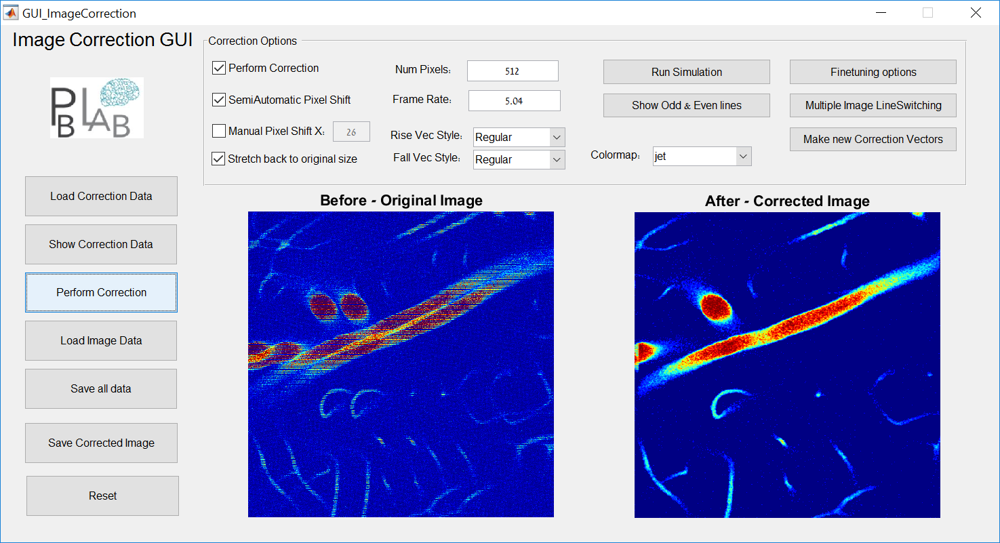
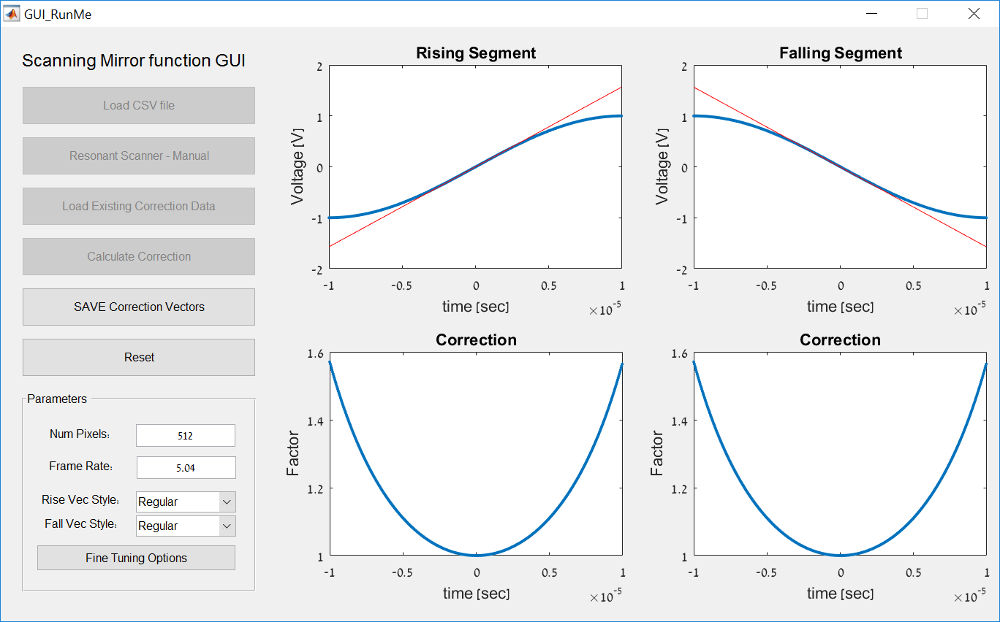

# "Image Correction and Formation for positioning of ultrafast beam steering elements for volumetric multiphoton imaging reconstruction in mammalian brain”

Eran Grabiner and Hagai Rossman, August 2016

Under Dr. Pablo Blinder, Department of Neurobiology, Tel-Aviv University, [Blinder Lab](http://pblab.tau.ac.il/en/)

And advisory of Lior Golgher & Hagai Hargil

## Image Correction GUI

Deals with Pixel-Shift and Non-Linear corrections

Also alows LineSwitching Correction for stacked images

Open ImageCorrection\GUI_ImageCorrection.m

Works on Matlab 2014, some functions need Image Processing ToolBox

## Scanning Mirror function Extractor 

Developer tool for caclulating and saving new Non-Linear Correction Vectors if new equipment is used in the lab

Open ScanningMirrorFunctionTool\GUI_RunMe.m

